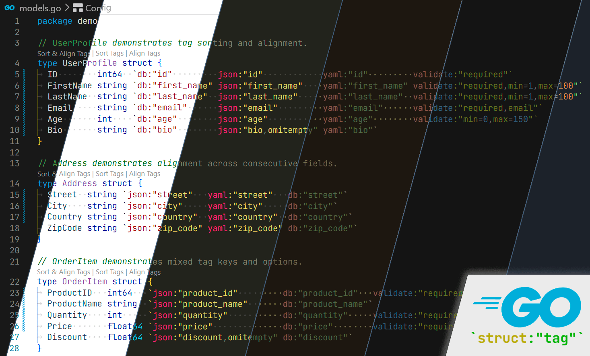
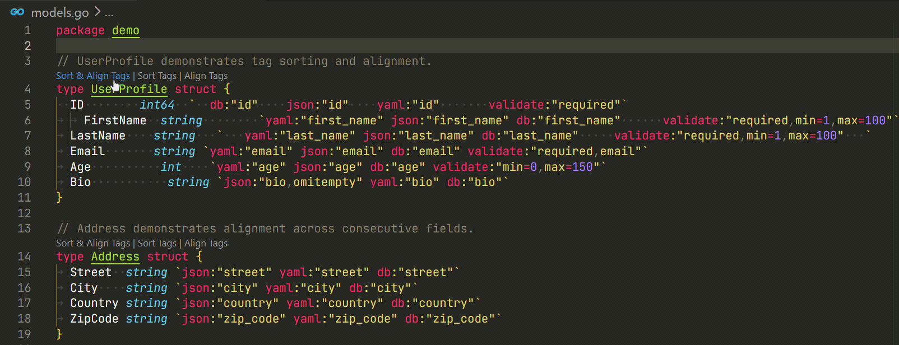

# Go Struct Tags Manager

VSCode extension for Go struct field tags:
syntax highlighting, sorting, and alignment.



## Features

### Syntax Highlighting

Tags are colored using your current theme - no hardcoded colors,
no background overrides that would break selection highlighting.

Each part of a tag gets a distinct color from the active theme:

* **Key** (`json`, `yaml`, `db`, …) - attribute color
* **Value** (`"my_field"`) - string color
* **Option** (`omitempty`, `required`, `min=1`) - constant color
* **Separator** (`,`) - punctuation color

### CodeLens Actions

Three inline actions appear above every struct that has tagged fields:

```txt
Sort & Align Tags  |  Sort Tags  |  Align Tags
type UserProfile struct {
```



### Sort Tags

Reorders tag keys across all fields of a struct to a consistent canonical order.

**`first-field` mode** (default) - order is derived from the first field:
keys present there come first,
the rest follow in the order they are first encountered across the struct.

Before:

```go
type User struct {
    ID    int    `json:"id"    yaml:"id"`
    Name  string `yaml:"name" json:"name" db:"name"`
    Email string `db:"email"  json:"email"`
}
```

After (`sortPriority: ["json", "yaml"]`):

```go
type User struct {
    ID    int    `json:"id"    yaml:"id"`
    Name  string `json:"name" yaml:"name" db:"name"`
    Email string `json:"email" db:"email"`
}
```

**`alphabetical` mode** - all keys sorted A->Z (after applying `sortPriority`).

### Align Tags

Pads tag columns with spaces so values line up vertically.
Only applied to **consecutive fields** -
groups separated by blank lines are aligned independently.

Before:

```go
type Address struct {
    Street  string `json:"street" yaml:"street" db:"street"`
    City    string `json:"city" yaml:"city" db:"city"`
    Country string `json:"country" yaml:"country" db:"country"`
    ZipCode string `json:"zip_code" yaml:"zip_code" db:"zip_code"`
}
```

After:

```go
type Address struct {
    Street  string `json:"street"  yaml:"street"  db:"street"`
    City    string `json:"city"    yaml:"city"    db:"city"`
    Country string `json:"country" yaml:"country" db:"country"`
    ZipCode string `json:"zip_code" yaml:"zip_code" db:"zip_code"`
}
```

Fields separated by blank lines or comments are treated
as separate groups and aligned independently.

### Normalize Tags

Both Sort and Align automatically normalize tags:
strip extra spaces inside the backtick string
and ensure a single space between each `key:"value"` pair.

```go
// Before
Field string `   json:"id"      yaml:"id"   `

// After
Field string `json:"id" yaml:"id"`
```

## Commands

All commands are available in the Command Palette
(`Ctrl+Shift+P` / `Cmd+Shift+P`) under the **Go Struct Tags Manager** category.

* **Sort Struct Field Tags** -
  sort tags in the struct at cursor
* **Align Struct Field Tags** -
  align tags in the struct at cursor
* **Sort & Align Struct Field Tags** -
  sort then align in the struct at cursor
* **Sort Struct Field Tags in File** -
  apply sort to all structs in the file
* **Align Struct Field Tags in File** -
  apply alignment to all structs in the file
* **Sort & Align Struct Field Tags in File** -
  apply sort & align to all structs in the file

## Settings

* **`goStructTags.autoSortOnSave`** `boolean` -
  automatically sort tags on file save.  
  _Default: `false`._
* **`goStructTags.autoAlignOnSave`** `boolean` -
  automatically align tags on file save.  
  _Default: `false`._
* **`goStructTags.sortMode`** `"smart" | "first-field" | "alphabetical"` -
  how to determine canonical key order when sorting.  
  _Default: `"smart"`._
* **`goStructTags.sortPriority`** `string[]` -
  tag keys that always come first, in the specified order,
  regardless of `sortMode`.  
  _Default: `[]`._
* **`goStructTags.alignColumnThreshold`** `number` -
  minimum fraction of fields in an alignment group (0–1) for a tag to receive
  a dedicated column; tags below the threshold are appended without padding.  
  _Default: `0.5`._
* **`goStructTags.colors.key`** `string` -
  override color for tag keys (e.g. `json`, `yaml`).  
  _Leave empty to use theme color._
* **`goStructTags.colors.value`** `string` -
  override color for tag values.  
  _Leave empty to use theme color._
* **`goStructTags.colors.option`** `string` -
  override color for tag options (after `=`).  
  _Leave empty to use theme color._
* **`goStructTags.colors.separator`** `string` -
  override color for tag separators (`,`).  
  _Leave empty to use theme color._

### Example configuration

```json
{
  // Always put json and yaml first, then sort the rest alphabetically
  "goStructTags.sortMode": "alphabetical",
  "goStructTags.sortPriority": ["json", "yaml"],

  // Auto-sort and align on every save
  "goStructTags.autoSortOnSave": true,
  "goStructTags.autoAlignOnSave": true
}
```

Color overrides accept any CSS color value (`#rrggbb`, `rgba(...)`,
theme token color, etc.).

## Theme Compatibility

Syntax highlighting works via TextMate grammar injection
into Go raw string literals.
Colors depend entirely on how your active theme maps
the underlying token scopes -
the extension does not hardcode any colors by default.

Scope mapping used:

* Key (`json`, `yaml`, …) -> `entity.name.tag`
* Value (quoted string content) -> `string.quoted.double`
* Option key (before `=`) -> `variable.other`
* `=` operator -> `keyword.operator`
* Option value (after `=`) -> `constant.numeric`
* Separator (`,`) -> `comment`

Themes known to color all parts well:
Monokai, One Dark Pro, Dracula, Tokyo Night, Catppuccin.

Themes with partial support (keys and values visible, options highlighted):
Default Dark+, Default Light+.

If your theme shows missing or incorrect colors —
for example all parts blending into the surrounding string color —
configure overrides directly.
The colors below match the Default Dark+ palette:

```json
{
  "goStructTags.colors.key":       "#4EC9B0",
  "goStructTags.colors.value":     "#CE9178",
  "goStructTags.colors.option":    "#B5CEA8",
  "goStructTags.colors.separator": "#6A9955"
}
```

For Default Light+:

```json
{
  "goStructTags.colors.key":       "#267F99",
  "goStructTags.colors.value":     "#A31515",
  "goStructTags.colors.option":    "#098658",
  "goStructTags.colors.separator": "#008000"
}
```
